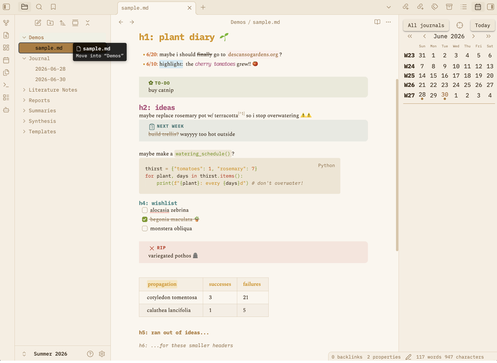

# 🍰 Sugar

`chooliu/obsidian-sugar-template`
a theme set for obsidian with four sweet pastel palettes, plus a little tool for baking your own.

## flavors

| palette | tones |
|---|---|
| **taro** | light pastels on dark grey (dark mode default) |
| **cinnamon** | earthy and warm browns on cream (light mode default) |
| **sugarplum** | bright and saturated tones on white |
| **fairyfloss classic** | original pastels on purple port of [sailorhg](https://sailorhg.github.io/fairyfloss/)'s iconic theme! |

these values are in `theme.css` & you can preview in `swatches.html`!

(cinnamon)

## install sugar

once it's in the obsidian community directory: settings → appearance → themes → browse → "Sugar" (submitted)

manually, until then:
* download from releases or clone repo
* copy `theme.css` + `manifest.json` into `<your-vault-filepath>/.obsidian/themes/Sugar/`
* activate theme via **settings → appearance → themes → sugar**
* choose from the four presets with the [style settings](https://github.com/mgmeyers/obsidian-style-settings) community plugin...
* ...or edit `theme.css`, potentially with the **palette editor!**

## bake your own!

* shipping with **palette editor** stand-alone, interactive .html file, `palette-editor.html` to help pick colors and edit `theme.css`!
* [chooliu.github.io/obsidian-sugar-template](https://chooliu.github.io/obsidian-sugar-template/) → palette editor → copy/download `.css`

## credits

palette and spirit inspired by [sailorhg's fairyfloss](https://sailorhg.github.io/fairyfloss/) && my love of googling 'productivity tips' as a way to procrastinate

MIT license, customize & enjoy!